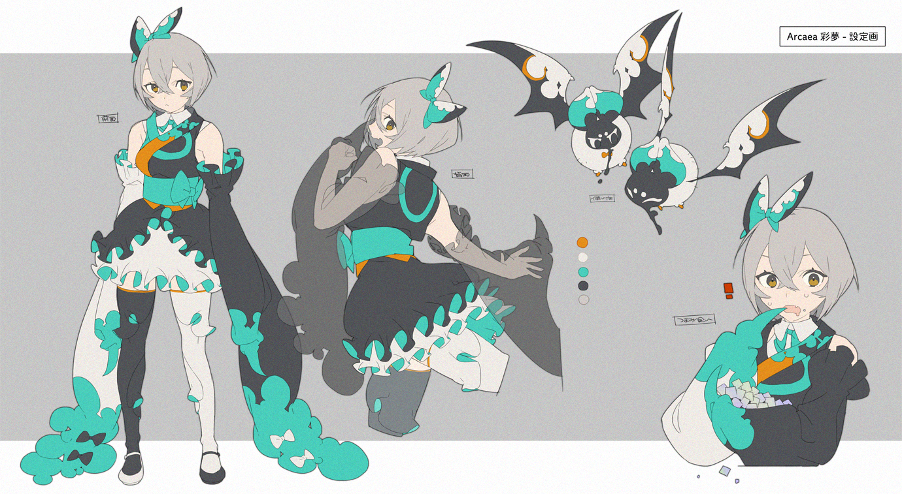

 
    <i>Ayu_s</i> by そゐち / sowiti
 

### Hi, this is Maxwell Jay

- 🌱 Undergraduate majoring in **Automation** at [Harbin Institute of Technology, Shenzhen](https://www.hitsz.edu.cn/).
- 👯 Member of [HITSZ OpenAuto](https://github.com/HITSZ-OpenAuto), mainly working on documentation and file management.
- 🔭 Interested in **Robotics** and **Embedded Systems**. Former team member of [HITSZ-VEX 南工麟云](https://space.bilibili.com/3493271458285683).
- 🌞 Morning bird, not a night owl.

<!--
**MaxwellJay256/MaxwellJay256** is a ✨ _special_ ✨ repository because its `README.md` (this file) appears on your GitHub profile.

Here are some ideas to get you started:

- 🔭 I’m currently working on ...
- 🌱 I’m currently learning ...
- 👯 I’m looking to collaborate on ...
- 🤔 I’m looking for help with ...
- 💬 Ask me about ...
- 📫 How to reach me: ...
- 😄 Pronouns: ...
- ⚡ Fun fact: ...
-->
