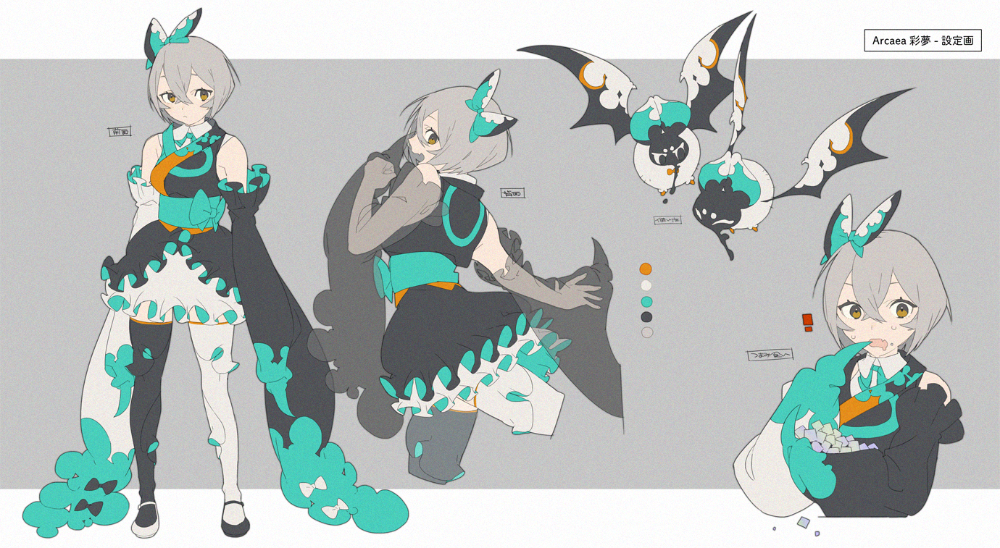

<!--

 
    <i>Ayu_s</i> by そゐち / sowiti
 

-->

 
    <i>見えてくる</i> by usahori
 

### Hi, this is Maxwell Jay

- 🌱 Graduate majoring in **Automatic Control** at [Harbin Institute of Technology, Shenzhen](https://www.hitsz.edu.cn/).
- 👯 Co-founder of [HITSZ OpenAuto](https://github.com/HITSZ-OpenAuto).
- 🔎 My research focuses on brain-computer interface (BCI) for medical purpose.
- 🔭 I'm interested in advanced embedded hardware & software development.
- 🎮 Hobby: DJ & HiFi music.

  <b>
    HITSZ-related Repositories
  </b>

My repositories below may be helpful for HITSZ undergraduates.

- [mega_12800](https://github.com/MaxwellJay256/mega_12800)
- [CppLab_2023](https://github.com/MaxwellJay256/CppLab_2023)
- [MetroTicketingSystem](https://github.com/MaxwellJay256/MetroTicketingSystem)
- [Bike-Computer](https://github.com/MaxwellJay256/Bike-Computer)
- [FPGALab_2024](https://github.com/MaxwellJay256/FPGALab_2024)
- [dip_ws_2024](https://github.com/MaxwellJay256/dip_ws_2024)
- [DDR4](https://github.com/MaxwellJay256/DDR4)
- [PatternRecognitionLab_2024](https://github.com/MaxwellJay256/PatternRecognitionLab_2024)

<!--
**MaxwellJay256/MaxwellJay256** is a ✨ _special_ ✨ repository because its `README.md` (this file) appears on your GitHub profile.

Here are some ideas to get you started:

- 🔭 I’m currently working on ...
- 🌱 I’m currently learning ...
- 👯 I’m looking to collaborate on ...
- 🤔 I’m looking for help with ...
- 💬 Ask me about ...
- 📫 How to reach me: ...
- 😄 Pronouns: ...
- ⚡ Fun fact: ...
-->
